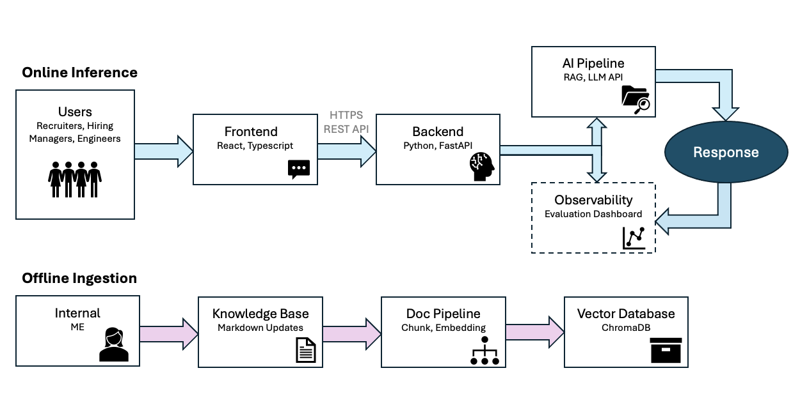
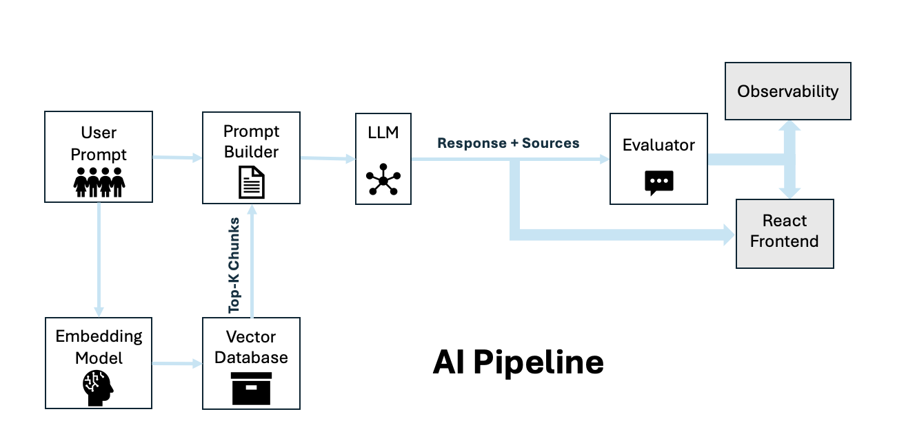
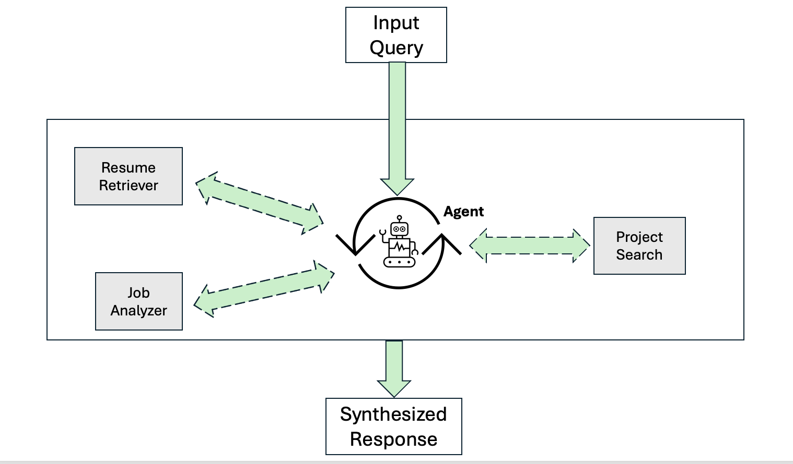

# System Architecture 

## High-Level Overview

## Frontend Architecture

React communicates with FastAPI through REST APIs. 

## Backend Architecture

FastAPI handles:
- request validation
- retrieval orchestration
- prompt construction
- LLM calls

## RAG Pipeline

### Ingestion Flow

Markdown files &rarr; chunks &rarr; embeddings &rarr; vector database

### Inference Flow
Question &rarr; embedding &rarr; retrieval &rarr; prompt &rarr; LLM &rarr; response

### Backend Layers

## API Transport
- Handles HTTP requests/responses
- Validates schemas using Pydantic
- Exposes REST endpoints

## Service
- Coordinates RAG workflow
- Independent from transport layer

## Retrieval
- Converts query &rarr; embedding
- Performs similarity search
- Returns relevant chunks

## Generation
- Builds grounded prompt
- Calls LLM
- Returns final response

## Future Work

